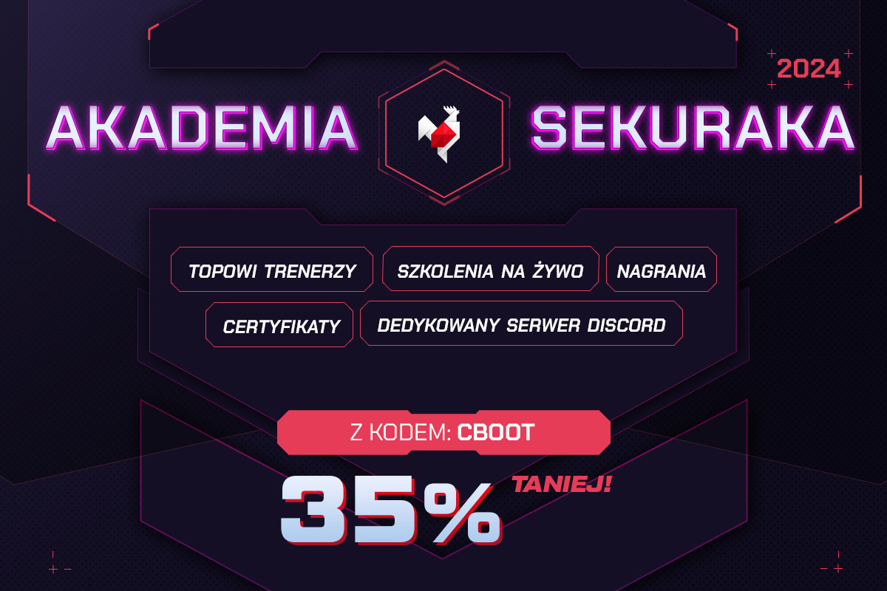
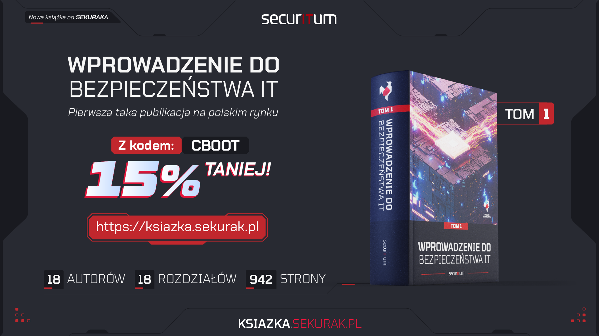

# Atak cold boot na żywo. Czyli jak zdeszyfrować laptopa zamrażając kości pamięci?
Repozytorium zawiera prezentację, komendy oraz snippety, które pojawiły w trakcie szkolenia w ramach Sekurak Academy.
W repozytorium znajduje się kilka plików:
- **Cold_Boot_Attack.pdf** - PDF z prezentacją,
- [**images.7z**](https://leftarcode.com/coldboot/images.7z) - na zewnętrznym serwerze, bo ma ~1GB izawiera dwa pliki:
    - **bitlocker.img** - zrzut 100 pierwszych sektorów z partycji BitLockera,
    - **ram.img** - zrzut pamięci RAM uzyskany w trakcie szkolenia.
- **generate_fvek.py** - skrypt wykorzystany w trakcie szkolenia do wygenerowania pliku FVEK dla Dislocker'a.
- **fvek.key** - plik FVEK wygenerowany przez powyższy skrypt.

---

Gorąco zachęcam do spróbowania swoich sił w poszukiwaniach kluczy BitLocker'a w pamięci RAM.
Dla programistów ciekawym wyzwaniem może być napisanie własnego narzędzia, które znajdzie klucze Full Volume Encryption Key bazując na wiedzy ze szkolenia.
Dodatkową inspiracją może być plugin do Volatility:
- [Extracting BitLocker keys with Volatility](https://tribalchicken.net/extracting-bitlocker-keys-with-volatility-part-1-poc/)
- [Volatility-BitLocker](https://github.com/breppo/Volatility-BitLocker/blob/master/bitlocker.py)

---

Dodatkowo, specjalnie dla uczestników szkolenia zostały przygotowane kody rabatowe na książkę oraz na dostęp do Sekurak Academy :)

# Bibliografia
1. DLACZEGO ROZPRĘŻANIE GAZU PROWADZI DO OBNIŻENIA TEMPERATURY?
    - https://zapytajfizyka.fuw.edu.pl/pytania/dlaczego-rozprezanie-gazu-prowadzi-do-obnizenia-temperatury/
2. Lest We Remember: Cold Boot Attacks on Encryption Keys
    - https://www.usenix.org/legacy/event/sec08/tech/full_papers/halderman/halderman.pdf
3. Lest we forget: Cold-boot attacks on scrambled DDR3 memory
    - https://www.johannes-bauer.com/personal/publications/2016-03-Bauer-DFRWS-EU.pdf
4. Recovering BitLocker Keys on Windows 8.1 and 10
    - https://tribalchicken.net/recovering-bitlocker-keys-on-windows-8-1-and-10/
5. Plugin do Volatility
    - https://github.com/elceef/bitlocker/blob/master/bitlocker.py
6. Radare2
    - https://github.com/radareorg/radare2
7. Dislocker
    - https://github.com/Aorimn/dislocker
